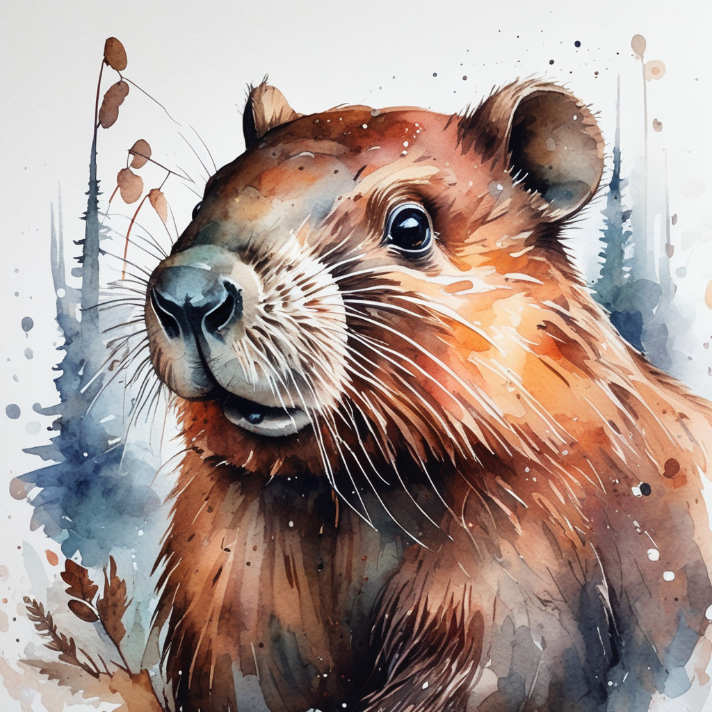

# Aesthetic Post-Training Diffusion Models from Generic Preferences with Step-by-step Preference Optimization
 [Zhanhao Liang](https://github.com/RockeyCoss), [Yuhui Yuan](https://www.microsoft.com/en-us/research/people/yuyua/), [Shuyang Gu](https://cientgu.github.io), [Bohan Chen](https://github.com/BHCHENGIT), [Tiankai Hang](https://tiankaihang.github.io/), [Mingxi Cheng](https://sites.google.com/a/usc.edu/mingxicheng/), [Ji Li](https://sites.google.com/a/usc.edu/jili/), [Liang Zheng](https://zheng-lab.cecs.anu.edu.au)
 
<a href="https://arxiv.org/abs/2406.04314"></a>
<a href="https://rockeycoss.github.io/spo.github.io/"></a>
<a href="https://huggingface.co/SPO-Diffusion-Models"></a>


This is the official implementation of SPO, introduced in [Aesthetic Post-Training Diffusion Models from Generic Preferences with Step-by-step Preference Optimization](https://arxiv.org/abs/2406.04314).

## Abstract
<p>
    Generating visually appealing images is fundamental to modern text-to-image generation models. 
    A potential solution to better aesthetics is direct preference optimization (DPO), 
    which has been applied to diffusion models to improve general image quality including prompt alignment and aesthetics. 
    Popular DPO methods propagate preference labels from clean image pairs to all the intermediate steps along the two generation trajectories. 
    However, preference labels provided in existing datasets are blended with layout and aesthetic opinions, which would disagree with aesthetic preference. 
    Even if aesthetic labels were provided (at substantial cost), it would be hard for the two-trajectory methods to capture nuanced visual differences at different steps.
</p>
<p>
    To improve aesthetics economically, this paper uses existing generic preference data and introduces step-by-step preference optimization 
    (SPO) that discards the propagation strategy and allows fine-grained image details to be assessed. Specifically, 
    at each denoising step, we 1) sample a pool of candidates by denoising from a shared noise latent, 
    2) use a step-aware preference model to find a suitable win-lose pair to supervise the diffusion model, and 
    3) randomly select one from the pool to initialize the next denoising step. 
    This strategy ensures that diffusion models focus on the subtle, fine-grained visual differences 
    instead of layout aspect. We find that aesthetic can be significantly enhanced by accumulating these 
    improved minor differences.
</p>
<p>
    When fine-tuning Stable Diffusion v1.5 and SDXL, SPO yields significant 
    improvements in aesthetics compared with existing DPO methods while not sacrificing image-text alignment 
    compared with vanilla models. Moreover, SPO converges much faster than DPO methods due to the step-by-step 
    alignment of fine-grained visual details.
</p>

## Method Overview


## TODO
- [x] Release training code for step-aware preference model
- [x] Release training code for SPO
- [x] Release checkpoints and inference code
- [x] Initialization

## Gallery
<table>
  <tr>
    <td></td>
    <td></td>
    <td></td>
    <td></td>
  </tr>
  <tr>
    <td></td>
    <td></td>
    <td></td>
    <td></td>
  </tr>
  <tr>
    <td></td>
    <td></td>
    <td></td>
    <td></td>
  </tr>
  <tr>
    <td></td>
    <td></td>
    <td></td>
    <td></td>
  </tr>
  <tr>
    <td></td>
    <td></td>
    <td></td>
    <td></td>
  </tr>
</table>

## :wrench: Usage
For SPO training and inference using the available checkpoints, please refer to [spo_training_and_inference](spo_training_and_inference/).

For the training of the step-aware preference model, please refer to [step_aware_preference_model](step_aware_preference_model/).

## :unlock: Available Checkpoints

[SPO-SDXL_4k-prompts_10-epochs](https://huggingface.co/SPO-Diffusion-Models/SPO-SDXL_4k-p_10ep)

[SPO-SDXL_4k-prompts_10-epochs_LoRA](https://huggingface.co/SPO-Diffusion-Models/SPO-SDXL_4k-p_10ep_LoRA)

[SPO-SD-v1-5_4k-prompts_10-epochs](https://huggingface.co/SPO-Diffusion-Models/SPO-SD-v1-5_4k-p_10ep)

[SPO-SD-v1-5_4k-prompts_10-epochs_LoRA](https://huggingface.co/SPO-Diffusion-Models/SPO-SD-v1-5_4k-p_10ep_LoRA)

## Acknowledgement
Our codebase references the code from [Diffusers](https://github.com/huggingface/diffusers), [D3PO](https://github.com/yk7333/d3po) and [PickScore](https://github.com/yuvalkirstain/PickScore). We extend our gratitude to their authors for open-sourcing their code.

## :mailbox_with_mail: Citation
If you find this code useful in your research, please consider citing:

```
@article{liang2024step,
  title={Aesthetic Post-Training Diffusion Models from Generic Preferences with Step-by-step Preference Optimization},
  author={Liang, Zhanhao and Yuan, Yuhui and Gu, Shuyang and Chen, Bohan and Hang, Tiankai and Cheng, Mingxi and Li, Ji and Zheng, Liang},
  journal={arXiv preprint arXiv:2406.04314},
  year={2024}
}
```
